# Performance and Independence Climate Model Weighting for CMIP6 Projections

**ETH Zurich -- Climate Change, Uncertainty and Risk Modelling (FS 2026)**

This project implements a simplified version of the [Knutti et al. (2017)](papers/Knuttietal.-2017-GeophysicalResearchLetters.pdf) climate model weighting methodology applied to CMIP6 global surface air temperature (GSAT) projections under the SSP2-4.5 scenario. Instead of treating all climate models equally, we assign statistical weights based on how well each model reproduces observed warming and how structurally independent it is from other models.

---

## Motivation

Multi-model ensembles like CMIP6 are a cornerstone of climate projection, but treating every model equally ("one model, one vote") has known problems:

- Some models reproduce historical observations much better than others.
- Many models share code lineage or parameterizations, so including them all with equal weight effectively double-counts certain modeling choices.

Performance-and-independence weighting addresses both issues by upweighting skillful, structurally unique models and downweighting poor or redundant ones.

---

## Methodology

### Weighting Formula

Each model *i* receives a combined weight:

```
w_i  proportional to  Performance(i) x Independence(i)
```

**Performance term** -- based on RMSE against ERA5 reanalysis over 1940-2014:

```
Performance(i) = exp( -D_i^2 / sigma_D^2 )
```

**Independence term** -- based on pairwise RMSE between model ensemble means:

```
Independence(i) = 1 / (1 + sum_{j != i} exp( -S_ij^2 / sigma_S^2 ))
```

The tuning parameters `sigma_D = 0.08 C` and `sigma_S = 0.31 C` were selected as a conservative midpoint between a grid-search optimum and data-driven defaults (see [Sensitivity Analysis](#sensitivity-analysis)).

### Key Time Periods

| Period | Years | Purpose |
|---|---|---|
| Reference | 1981-2014 | Anomaly baseline |
| Calibration | 1940-2014 | Weight computation |
| Hindcast training | 1940-1989 | Out-of-sample validation (train) |
| Hindcast test | 1990-2014 | Out-of-sample validation (test) |
| Future projection | 2025-2100 | SSP2-4.5 scenario |
| End-of-century | 2071-2100 | Summary statistics |

---

## Results

### Historical and Future Trajectories

The figure below shows all ~20 CMIP6 model trajectories (grey), the ERA5 observations (black), and the weighted vs. equal-weight ensemble means with 17-83% uncertainty bands.

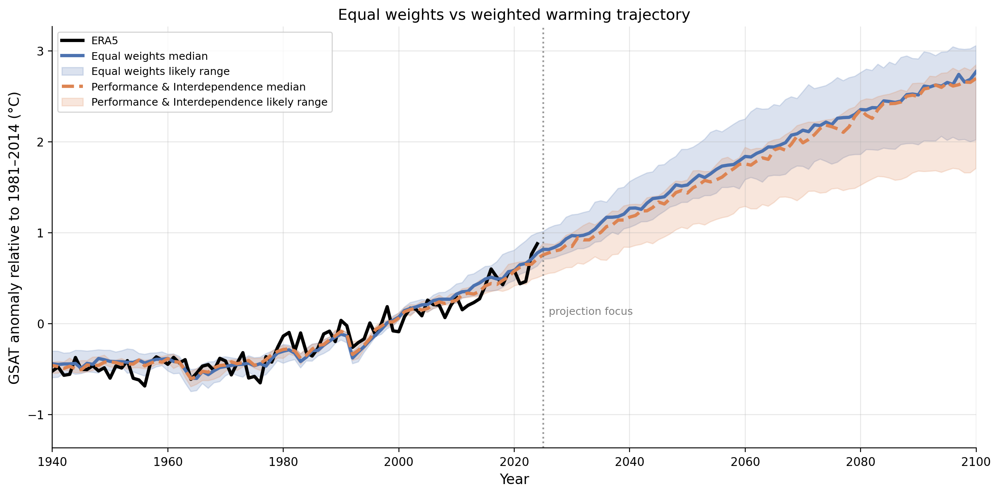

Zooming into the future projection period (2025-2100) highlights the divergence between equal-weight and performance+independence weighted projections:

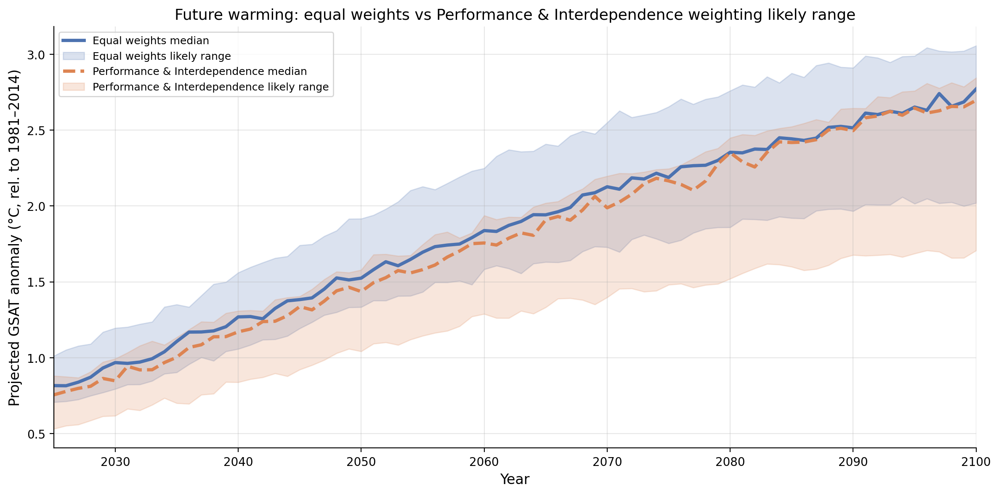

### End-of-Century Warming Summary

| Weighting | Mean (2071-2100) | 17-83% Range |
|---|---|---|
| Equal-weight | 3.45 C | +/- 0.21 C |
| Perf.+Indep. | 3.31 C | +/- 0.19 C |

The weighted projection is **0.14 C lower** with a **narrower uncertainty range**.

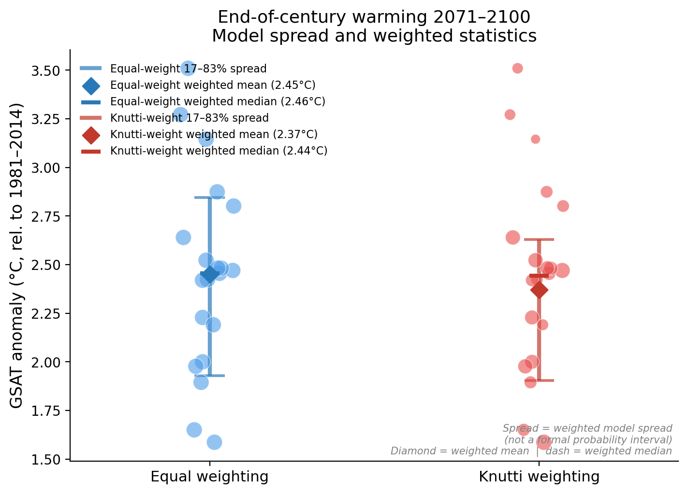

### Historical Performance Ranking

Models are ranked by their RMSE against ERA5 observations. This lollipop chart shows which models best reproduce observed historical warming:

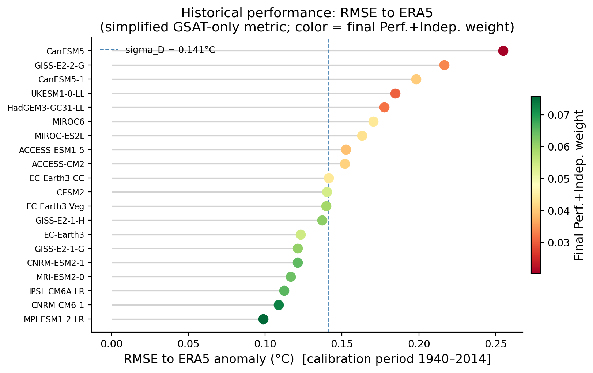

### Model Interdependence

The clustered heatmap reveals which models are structurally similar to each other based on pairwise RMSE of their historical trajectories. Clusters of similar models (low S_ij) indicate shared code lineage or parameterizations:

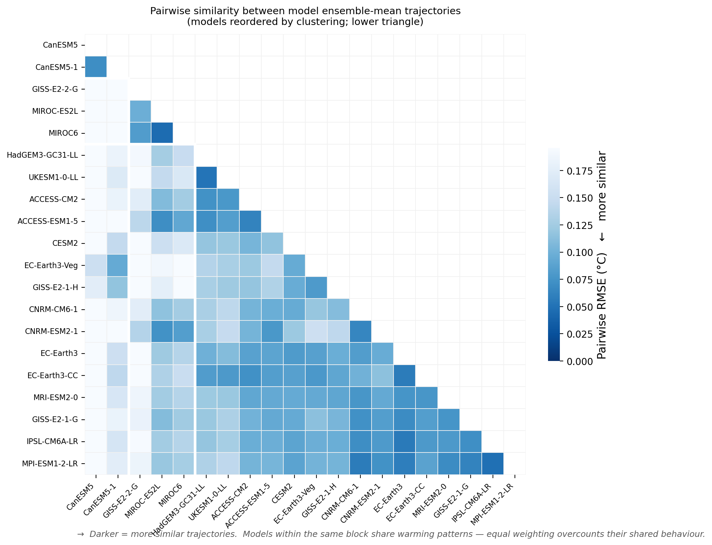

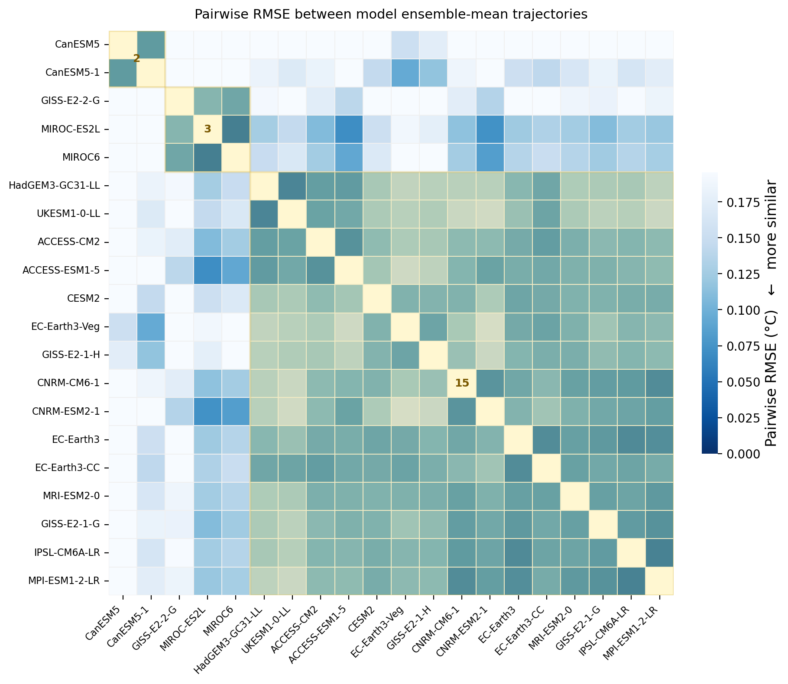

### Weight Decomposition

This chart decomposes each model's final weight into its performance and independence components, showing how the two criteria interact:

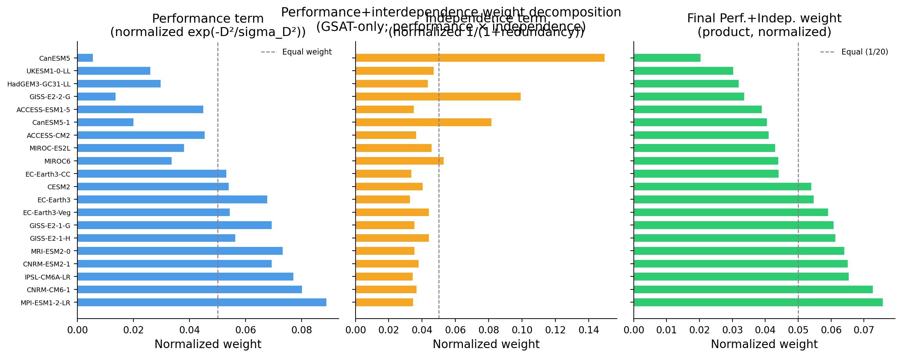

The scatter plot below visualizes the trade-off -- models in the upper-right (high performance, high independence) receive the largest weights:

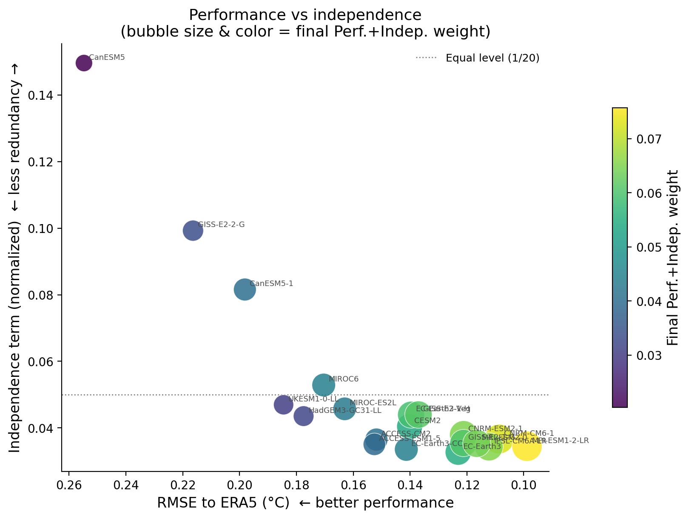

---

## Validation

We validated the weighting scheme through four independent tests.

### 1. Hindcast Test (Out-of-Sample)

Weights were calibrated on 1940-1989 and tested against ERA5 on the held-out 1990-2014 period.

| Metric | Equal-weight | Perf.+Indep. | Improvement |
|---|---|---|---|
| RMSE | 0.1247 C | 0.1198 C | **3.9%** |
| MAE | 0.0956 C | 0.0925 C | 3.2% |
| Correlation | 0.8639 | 0.8654 | +0.0015 |

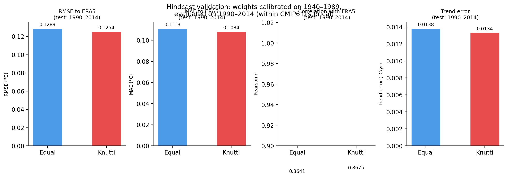

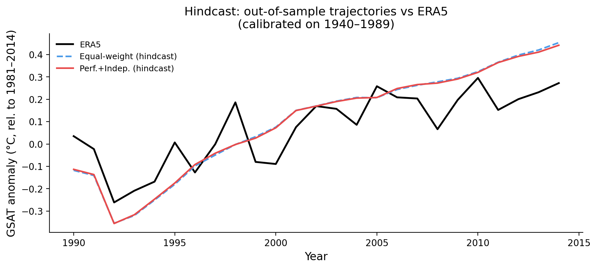

### 2. Perfect-Model Test

A leave-one-out cross-validation where each model serves as pseudo-observations. The RMSE ratio (weighted / equal) has a median of **0.975**, confirming the weighted scheme outperforms equal weighting in the majority of cases (13 out of ~20 models).

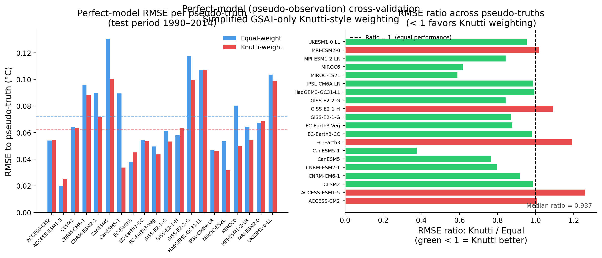

### 3. Sensitivity Analysis

A 15x15 grid search over sigma_D (0.02-0.30) and sigma_S (0.05-0.60) shows the end-of-century warming estimate ranges from 3.17 C to 3.43 C -- a spread of only 0.26 C, indicating moderate robustness to parameter choice.

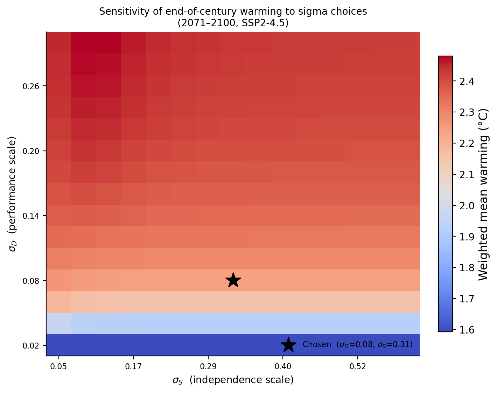

### 4. Smoothed RMSE Robustness

Comparing yearly vs. 5-year rolling-mean RMSE tests whether the weighting scheme captures the forced warming signal rather than overfitting to interannual variability:

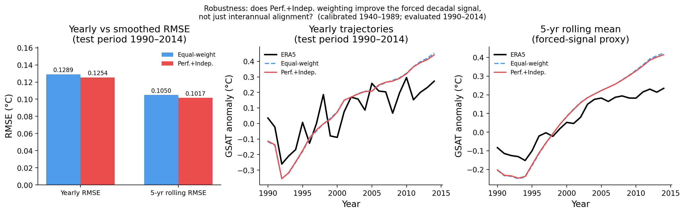

### 5. Coverage Test

The fraction of years where ERA5 falls within the 17-83% model spread should be approximately 66% for a well-calibrated ensemble:

| Period | Equal-weight | Perf.+Indep. |
|---|---|---|
| Calibration (1940-2014) | 74% | 74% |
| Test (1990-2014) | 69% | 68% |

Both are close to the 66% target, indicating good calibration.

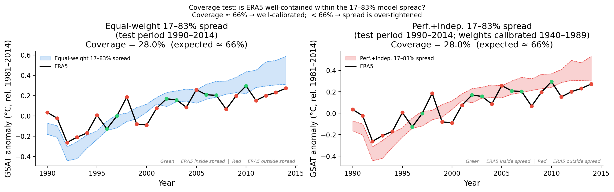

---

## Project Structure

```
.
├── climate_model_weighting.py          # Main analysis script (1420 lines)
├── data/
│   ├── cmip6_surface_temperature_5mems.pkl   # CMIP6 ensemble-mean data
│   └── era5_GSAT.pkl                         # ERA5 reanalysis observations
├── presentation_figures/                 # All generated figures (fig01-fig12)
├── papers/                               # Reference literature
│   ├── Knuttietal.-2017-GeophysicalResearchLetters.pdf
│   ├── Reichler_08_BAMS_Performance.pdf
│   ├── eaaz9549.full.pdf
│   └── esd-11-995-2020.pdf
├── 1.2 Real Model/                       # Reference exercise notebook + data
├── Kai_RealModel_Exercise_FS2026 (2).ipynb
└── weighing_schemes (1).ipynb
```

## Data Sources

- **CMIP6**: Ensemble-mean global surface air temperature from ~20 models (5 realizations each), historical + SSP2-4.5, 1850-2100.
- **ERA5**: ECMWF Reanalysis v5, global surface air temperature, 1940-2014.

## Requirements

- Python 3
- numpy, pandas, matplotlib, seaborn, scipy, scikit-learn

## Usage

```bash
python climate_model_weighting.py
```

This runs the full pipeline -- weight computation, projection, validation, and figure generation -- and saves all figures to `presentation_figures/`.

---

## Caveats

1. **GSAT-only metric** -- weighting is based solely on global mean temperature; regional or variable-specific skill is not considered.
2. **Pairwise RMSE as independence proxy** -- trajectory similarity may not fully capture structural model dependencies.
3. **Single scenario (SSP2-4.5)** -- results may differ under other emission pathways.
4. **Ensemble mean representation** -- using 5-member means reduces internal variability but doesn't eliminate it entirely.
5. **Stationarity assumption** -- historical performance may not predict future skill under novel forcing regimes.

## References

- Knutti, R., Sedlacek, J., Sanderson, B. M., Lorenz, R., Fischer, E. M., & Eyring, V. (2017). A climate model projection weighting scheme accounting for performance and interdependence. *Geophysical Research Letters*, 44(4), 1909-1918.
- Reichler, T., & Kim, J. (2008). How well do coupled models simulate today's climate? *Bulletin of the American Meteorological Society*, 89(3), 303-312.
